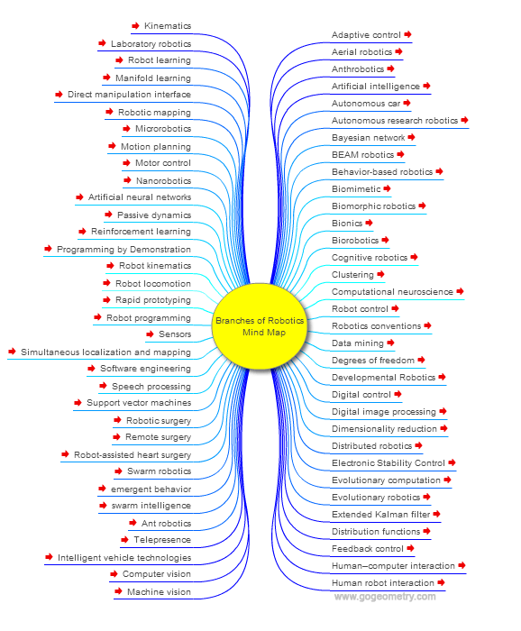
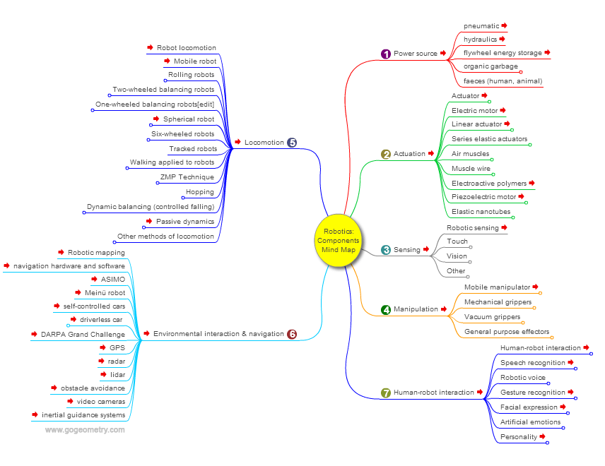
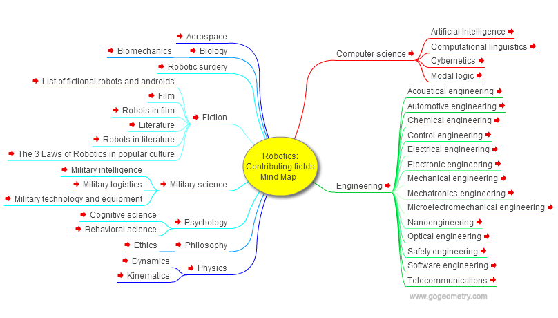

# Robotics

#### Definiton of robotics

"Robotics is the branch of engineering and science that involves the conception, design, manufacture, and operation of robots." — “Introduction to Robotics” by John J. Craig

"Robotics deals with the study of intelligent machines capable of performing tasks in the real world by sensing, planning, and acting." - “Robotics: Modelling, Planning and Control” by Siciliano & Sciavicco

##### In simpler terms

Robotics is the science and technology of building machines (robots) that can do tasks like humans or animals — such as moving, picking things up, or making decisions.

#### Core Concepts

- Perception: Using sensors to gather information from the environment.
- Planning: Making decisions based on input (e.g., navigation, manipulation).
- Control: Executing movements or actions through actuators.
- Autonomy: Some degree of decision-making without human input.
- Interaction: Responding to the environment or humans.

## Mind Map of Robotics

Note: The data obtained from source that was last updated on 2014

Source: https://gogeometry.com/robotics/

## Humanoid Robots

### 🔹 **University Programs and Humanoid Robotics Research**

* **User asked** for a global breakdown of universities that offer:

  * **All three programs**: Mechanical Engineering, Electrical Engineering, and Computer Science.
  * **Any one or more** of these.
* **Breakdown requested by**:

  * Country.
  * Education level: undergraduate, graduate, PhD.
* **Humanoid robotics data requested**, including:

  * Institutions **currently active** in humanoid robotics research.
  * Institutions that have **done work in the past**.
  * Institutions that **currently possess humanoid robots**.

> **Findings**:

* No comprehensive global database exists listing exact counts per country and level.
* Approximate global estimate: **930 institutions** offer engineering/computer science programs accredited by ABET.
* Several key countries (Japan, USA, Germany, China, South Korea, Singapore, South Africa) have institutions known for humanoid robotics.
* Active research institutions include **Waseda University**, **KAIST**, **KIT**, **Stanford**, among others.
* Institutions in countries like **South Africa** recently entered the field (e.g., Stellenbosch University, TUT).

---

### 🔹 **Capabilities of Humanoid Robots Compared to Other Robots**

* **User asked** what percentage of tasks done by other robots could be handled by humanoid robots.
* Also asked what percentage of **global human work** could be done by humanoid robots, versus work requiring specialized robots.

> **Estimates**:

* **\~50%** of tasks done by specialized robots could, in principle, be done by humanoid robots—but often **less efficiently**. (Multiple robots for different tasks and a single robot for various tasks)
* **\~25–30%** of global work (manual labor, routine cognitive tasks) could be done by humanoid robots.
* **\~40–50%** of tasks require **non-humanoid robots** due to speed, precision, form factor, or environment.
* Remaining **\~20–30%** of global work requires **humans** (creative, emotional, strategic tasks).

More detailed discussion can be found in:

- Source: https://chatgpt.com/share/6843b5ce-3198-8007-b50d-644871cdefde

To do: MindMap of robots by types of robots, application areas.

To do: Research on how many Universities are working on Humanoid Robots in different countries. Start new or already existing open source framework to work on, everyone contributes to that single/multiple repositories, by countries or international while maintaining the standards.

Make the university work on real-world, commercial-type humanoid robots, not only toy robots.
The majority work in commercial-level robots.

## Humanoid and Partial-Humanoid Robot Manufacturers

| Company         | Robot     | Audience               | Specs (mobility, DoF)                               | Control/SDK                                                       | Price (USD)          | Intl Avail.      | Open Source                   | Support                       |
| --------------- | --------- | ---------------------- | --------------------------------------------------- | ----------------------------------------------------------------- | -------------------- | ---------------- | ----------------------------- | ----------------------------- |
| SoftBank        | Pepper    | Commercial, education  | Wheeled base; 19 DoF; cameras, mics; tablet display | NAOqi OS; SDKs (Android, C++, Python, JS); ROS interface          | \~18k                | Yes              | No                            | Full docs, APIs, forums       |
| SoftBank        | NAO       | Education, research    | Biped 58 cm; 25 DoF; cameras, mics, sonar           | NAOqi OS; Choregraphe (Blockly/Scratch) plus C++/Python/Java; ROS | \~\$7.5k             | Yes              | No (but ROS)                  | Good docs, community          |
| Boston Dyn.     | Atlas     | Research/Demo          | Biped 1.8m; 28 DoF (hydraulic); LIDAR, stereo       | Custom (no public SDK); fleet API (Orbit)                         | N/A (R\&D only)      | No               | No                            | Internal support only         |
| Agility         | Digit     | Industrial (logistics) | Biped 1.75m; 16 DoF; LIDAR, 4×RealSense             | Linux RTOS; ROS-compatible (open)                                 | N/A (\~\$150k est)   | Yes              | Partial (ROS)                 | API docs on request           |
| Figure          | Figure 01 | Industrial             | Biped 1.68m; 40+ DoF; 20kg lift; 4.3 km/h           | Custom AI (closed); no SDK public                                 | — (undisclosed)      | Limited          | No                            | Enterprise support            |
| Figure          | Figure 02 | Industrial             | Biped \~1.67m; 20kg lift; 1.2 m/s                   | Custom AI; closed                                                 | —                    | Limited          | No                            | Enterprise support            |
| Hanson          | Sophia    | Research/entertainment | 1.67m; 83 DoF (face+body); vision/speech            | Proprietary (Ubuntu/ROS?); NLP engine                             | —                    | No               | No                            | Direct (company)              |
| PAL Robotics    | REEM-C    | Research               | 1.65m; 68 DoF; stereo vision, sonars                | Ubuntu/ROS; open (ROS-control, Gazebo)                            | €300k (\~\$320k)     | Yes              | Yes (ROS)                     | Docs, ROS examples            |
| PAL Robotics    | TALOS     | Industrial research    | 1.75m; 32 DoF; torque sensors                       | Ubuntu/ROS; MoveIt, OROCOS                                        | €900k (\~\$960k)     | Yes              | Yes (ROS)                     | Full docs, sim models         |
| UBTech          | Walker S1 | Industrial             | 1.72m; 41 DoF; fisheye 360° cam, Lidar              | ROSA OS (proprietary)                                             | —                    | Yes (by request) | No                            | English/Chinese documentation |
| EngineAI        | PM01      | Commercial/Education   | 1.38m; 24 DoF; waist 320°; 2 m/s                    | Custom L4S OS (ROS-based?)                                        | \~\$12.5k (yuan 88k) | Yes              | Partial (educational version) | Manuals for edu/custom        |
| Sanctuary AI    | Phoenix   | Industrial/logistics   | \~1.70m; \~70kg; payload 25kg; 20-DoF hands         | Custom “Carbon” AI OS                                             | —                    | Partnership      | No                            | Pilot documentation           |
| Engineered Arts | Ameca     | Entertainment/R\&D     | \~1.60m; 61 DoF; microphones, cameras               | Tritium OS (closed)                                               | —                    | Yes              | No                            | Full API/docs (Tritium)       |
| iCub Consortium | iCub      | Research               | 1.04m; 54 DoF; stereo vision, touch sensors         | Linux/YARP/ROS (open)                                             | \$300k               | Yes              | **Yes**                       | Open docs, academic support   |
| Willow Garage   | PR2       | Research               | 1.60m; 20 DoF; 2×7-DoF arms, omni-base, Kinect      | ROS (open)                                                        | \$400k (old)         | Legacy           | **Yes**                       | Community-maintained          |
| Kawada          | NEXTAGE   | Industrial             | 0.71m torso; 15 DoF; stereo cams                    | QNX-based, CORBA/Ethernet                                         | —                    | Yes              | No                            | Support from Kawada           |
| Apptronik       | Apollo    | Warehousing/Industry   | 1.73m; 72kg; 55 lb lift                             | Linux/ROS (likely)                                                | —                    | Yes              | No                            | SDK/docs to partners          |
| Agibot (China)  | A2        | Industrial/Service     | 1.75m; 55kg; 40+ DoF; 2 h runtime                   | AimRT (proprietary)                                               | —                    | Yes              | No                            | Distributor support           |
| Pudu Robotics   | D9        | Commercial service     | 1.70m; 42 DoF; dual arms 7-DoF                      | Pudu OS (closed)                                                  | —                    | Yes              | No                            | Pudu corporate support        |
| Unitree Robotics | **Go1**         | Consumer / hobbyist     | Quadruped, 12 motors (legs), ≈23.7 Nm torque per joint ([en.wikipedia.org][1])                          | Legged SDK (low‑level control; EDU supports full SDK)                               | From **\$2,700**                            | Yes (uses USD pricing, ships globally)                  | Partial: SDK via EDU; some ROS models  | Official support via Unitree; community projects |
| Unitree Robotics | **Go2**         | Consumer / research     | Quadruped \~15 kg, 12 motors, L1 4D LiDAR, 3–4 m/s speed; strong terrain adaptability                   | SDK (unitree\_sdk2), ROS/ROS2, OTA updates                                          | From **\$1,600** (\~\$2,800 w/ controller)  | Yes (worldwide including Europe/Asia)                   | Yes: unitree\_sdk2, ROS packages       | OTA updates, global sales/support                |
| Unitree Robotics | **B2**          | Industrial / commercial | Heavy-duty quadruped, >360 N·m joint torque, >40 kg payload, speeds up to 6 m/s                         | SDK (unitree\_legged\_sdk), ROS support (likely) ; industrial integration available | Contact (\~**\$100,000**)                   | Yes (global via distributors)                           | Likely SDK available; ROS household    | Enterprise-level support via Unitree             |
| Unitree Robotics | **G1**          | Research / development  | Humanoid, height ≈1.3 m, 23 DoF (base) up to 43 DoF (Edu+), \~120 N·m torque, supports dexterous hands  | SDK, ROS/ROS2, “UnifoLM” large-model, full-stack control                            | **\$16,000** base                           | Limited: research/industrial markets; global indicated  | ROS packages, SDK likely (new model)   | Research-grade support; Unitree R\&D back-end    |
| Unitree Robotics | **H1**          | Research / advanced use | Full-size humanoid, speeds \~7.38 mph, 5 leg + 4 arm DoF, depth + 3D LiDAR vision                       | SDK and ROS support (open‑source control software)                                  | **\$90,000** base (up to \$150k)            | Yes, global via dealers and CES showcase                | Fully open control stack               | Enterprise/research customer support             |
| Unitree Robotics | **Accessories** | Adds to robot teams     | Examples: 4D LiDAR L1/L2, batteries, controllers                                                        | ROS/ROS2 drivers included                                                           | \$249 – \$419 (LiDAR), \$500+ (batteries)   | Yes, supports global markets                            | SDK & ROS: Open SLAM solutions         | Official tech assistance & documentation         |
| Galbot  | **G1**      | Household, logistics, retail | Wheeled humanoid, \~88 kg, 25 DoF, 5 ft8″       | AI-driven control, Isaac Sim ecosystem  | Prototype: \~\$71k, future \~\$7k?  | Primarily China launch, sample global intent  | Likely open research (DexGraspNet)  | Startup support, research-first |

[1]: https://en.wikipedia.org/wiki/Unitree_Robotics?utm_source=chatgpt.com "Unitree Robotics"

[2]: https://www.unitree.com/g1?utm_source=chatgpt.com "Unitree G1"

More detailed information in the conversation below

Source: https://chatgpt.com/share/684564dc-b2d4-8007-8ddc-8162487dba64

Date the above information extracted: 10/06/2025

Update for any information presented above

