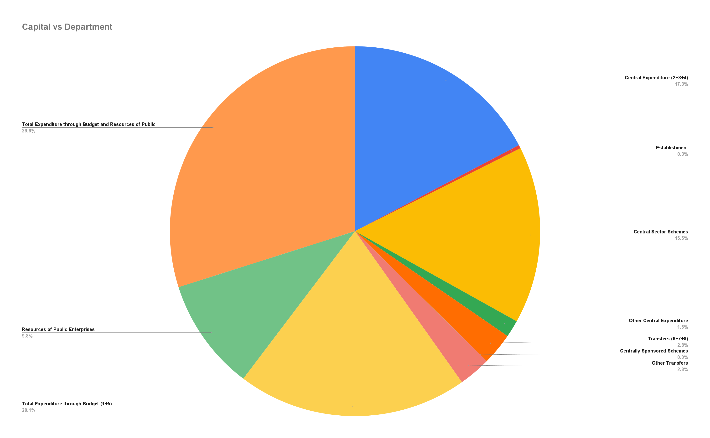
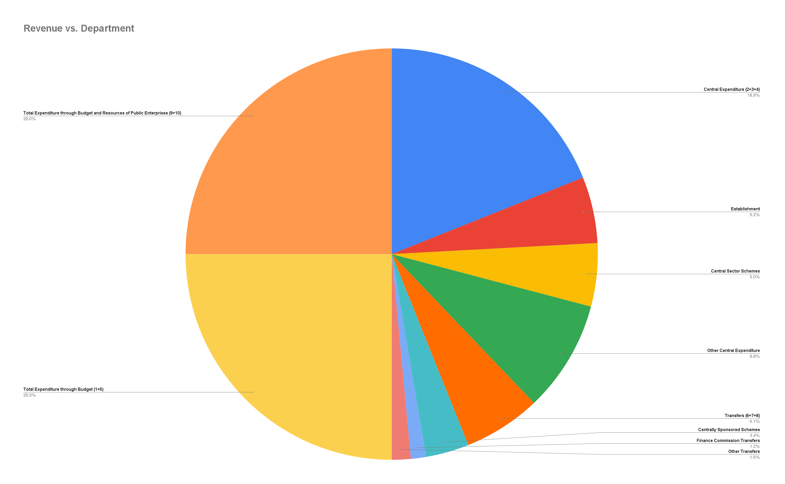
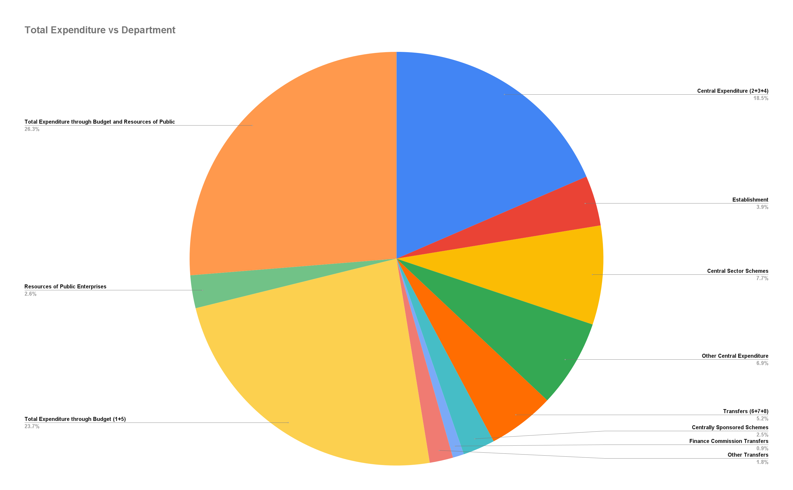

#                                  TRANSPARENCY IS THE KING

- Create a single website (By state) to track all the money collected by the government and spending, responsible person/person's.
- What is the cost of each project the government spent money on? how much actually spent? Why the extra spending?
- Project spending
- Bills of the same with responsible person/persons
- Open it to public
- Dummy me

# Metrics

- Fairness of business score
- Scam score
- Corruption score
- Exploitation score
- Greedy score
- Environmental impact score
- Wealth distribution score
- Charity score
- Community preference score
- Innovation score
- Profit/loss score
- Awesomeness score

EXPENDITURE PROFILE 2023-2024 [URL](https://www.indiabudget.gov.in/doc/eb/vol1.pdf)

