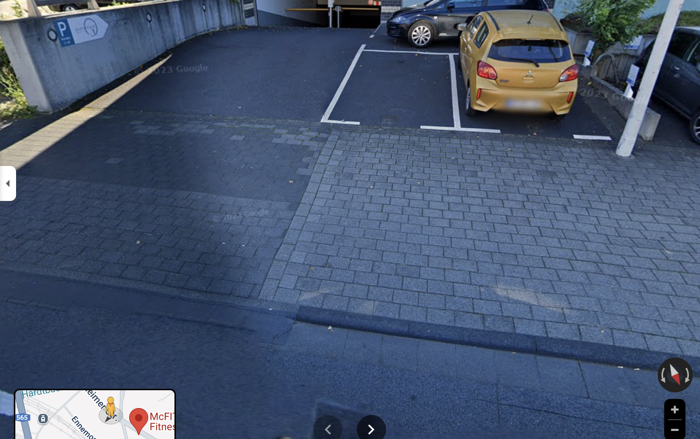
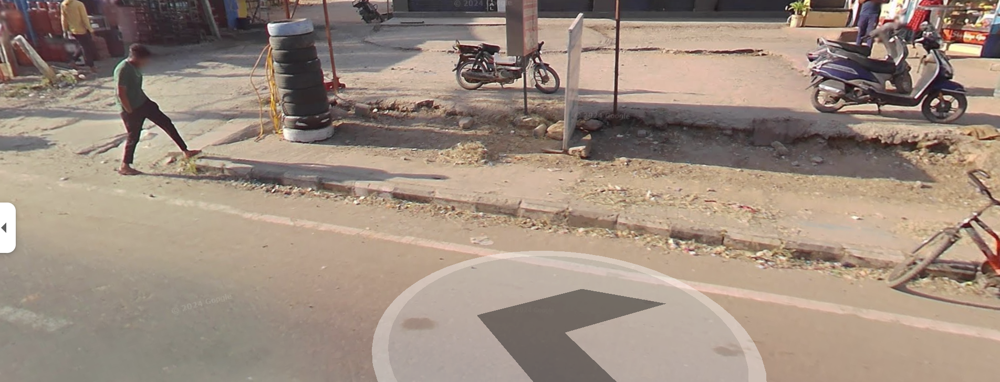

# Interlock pavers

When calculating the **total cost of installing interlock pavers**, you need to consider **not just the cost of the blocks themselves**, but also the **other essential components and labor** involved in the complete process. Here’s a detailed breakdown for **making and installing 1 square meter of interlock pavement**:

---

## 🧱 1. **Cost of Interlock Blocks**

* Assume **₹10 per piece** or **₹7-8 per piece** if optimized (from our earlier discussion)
* Pieces per sqm = 50
* Cost for blocks = ₹500 (₹10) or ₹350-400 (₹7-8)

---

## 🌍 2. **Ground Preparation**

| Activity                          | Details & Cost Estimate                                                                             |
| --------------------------------- | --------------------------------------------------------------------------------------------------- |
| **Excavation & leveling**         | Removing topsoil, leveling surface, compaction   - Equipment + labor   - Cost: ₹50-70 per sqm |
| **Sub-base layer (small stones)** | Layer of 75-100 mm crushed stone or gravel   - Material + labor   - Cost: ₹150-200 per sqm    |
| **Sand Bedding layer**            | 30-50 mm fine sand layer to lay blocks evenly   - Material + labor   - Cost: ₹50-70 per sqm   |

---

## 👷‍♂️ 3. **Labor Cost for Installation**

| Task                       | Description                              | Cost (₹ per sqm) |
| -------------------------- | ---------------------------------------- | ---------------- |
| Laying interlock blocks    | Manual placing, aligning, and compacting | ₹100 - 150       |
| Joint filling (sand sweep) | Filling gaps between blocks with sand    | ₹20 - 30         |
| Final compaction           | Using plate compactor                    | ₹30 - 50         |

---

## 🛠️ 4. **Additional Materials**

| Material                 | Approximate Cost ₹/sqm |
| ------------------------ | ---------------------- |
| Sand for joints          | ₹10-15                 |
| Edge restraints (if any) | ₹20-30                 |

---

## 💰 **Summary: Total Cost per Square Meter**

| Component                   | Cost (₹/sqm) Range |
| --------------------------- | ------------------ |
| Interlock Blocks (50 pcs)   | ₹350 - 500         |
| Ground Preparation          | ₹250 - 300         |
| Labor (laying + compaction) | ₹150 - 230         |
| Additional Materials        | ₹30 - 45           |
| **Total Estimated Cost**    | **₹780 - ₹1075**   |

---

## ⚠️ **Notes:**

* Costs vary based on **location**, **scale of work**, **availability of materials**, and **labor rates**.
* Prices are indicative for **India (semi-urban to urban areas)**.
* Using **heavier machinery** or **automated laying** may increase labor efficiency but add fixed costs.
* Thickness and strength of pavers affect cost significantly — thinner, optimized pavers reduce block costs but may impact durability.

To do

- Research on other cost effective and efficient methods that are in standard with the interlock pavers
- Policy for the same
- Timeline for the same and when to achive 100% of them. 
- Promotion of people who are taking the initiative and implementing them
- Research on quality standards (Look at developed countries)
- Formulate the problem as politicial based on the places and peoples mindset.
- Map the entire nation and find where all needs to be implemented.
- Collect data on poor work(shitting work and good work).
- Estimate for upgrading the entire nation road, sidewalks, shops entrance.
- .....etc

# Comparison of Good work and Shitting work

## Good work
Collected data on 29/05/2025,10:56 AM from google map
Plus code: P3QH+CM Bonn, Germany
Bornheimer Str. 129, 53119 Bonn, Germany
Location: https://maps.app.goo.gl/FGQHne8JcmwpQzrc7

## Shitting work
Collected data on 29/05/2025,11:00 AM from google map
IT capital of India, Sister city of San Francisco's(SF), Workers are sourced from across India, primarily from Karnataka and nearby states.
Plus code: VPX6+4R Bengaluru, Karnataka
Ambalipura - Sarjapur Rd, Hadosiddapura, Kodathi, Bengaluru, Karnataka 560099
Location: https://maps.app.goo.gl/zf5LwnVYkG982vt36
