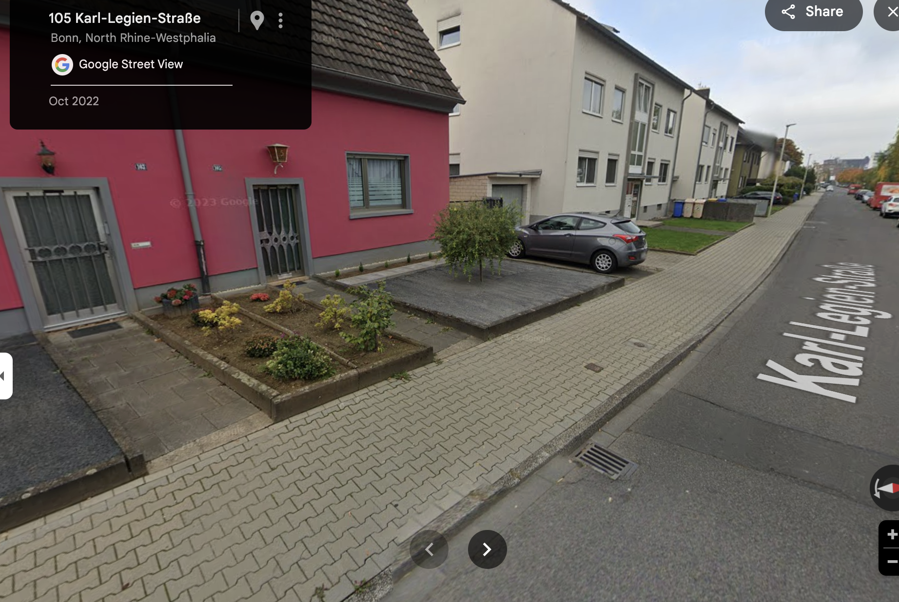

# Interlock pavers

When calculating the **total cost of installing interlock pavers**, you need to consider **not just the cost of the blocks themselves**, but also the **other essential components and labor** involved in the complete process. Here’s a detailed breakdown for **making and installing 1 square meter of interlock pavement**:

---

## 🧱 1. **Cost of Interlock Blocks**

* Assume **₹10 per piece** or **₹7-8 per piece** if optimized (from our earlier discussion)
* Pieces per sqm = 50
* Cost for blocks = ₹500 (₹10) or ₹350-400 (₹7-8)

---

## 🌍 2. **Ground Preparation**

| Activity                          | Details & Cost Estimate                                                                             |
| --------------------------------- | --------------------------------------------------------------------------------------------------- |
| **Excavation & leveling**         | Removing topsoil, leveling surface, compaction   - Equipment + labor   - Cost: ₹50-70 per sqm |
| **Sub-base layer (small stones)** | Layer of 75-100 mm crushed stone or gravel   - Material + labor   - Cost: ₹150-200 per sqm    |
| **Sand Bedding layer**            | 30-50 mm fine sand layer to lay blocks evenly   - Material + labor   - Cost: ₹50-70 per sqm   |

---

## 👷‍♂️ 3. **Labor Cost for Installation**

| Task                       | Description                              | Cost (₹ per sqm) |
| -------------------------- | ---------------------------------------- | ---------------- |
| Laying interlock blocks    | Manual placing, aligning, and compacting | ₹100 - 150       |
| Joint filling (sand sweep) | Filling gaps between blocks with sand    | ₹20 - 30         |
| Final compaction           | Using plate compactor                    | ₹30 - 50         |

---

## 🛠️ 4. **Additional Materials**

| Material                 | Approximate Cost ₹/sqm |
| ------------------------ | ---------------------- |
| Sand for joints          | ₹10-15                 |
| Edge restraints (if any) | ₹20-30                 |

---

## 💰 **Summary: Total Cost per Square Meter**

| Component                   | Cost (₹/sqm) Range |
| --------------------------- | ------------------ |
| Interlock Blocks (50 pcs)   | ₹350 - 500         |
| Ground Preparation          | ₹250 - 300         |
| Labor (laying + compaction) | ₹150 - 230         |
| Additional Materials        | ₹30 - 45           |
| **Total Estimated Cost**    | **₹780 - ₹1075**   |

---

## ⚠️ **Notes:**

* Costs vary based on **location**, **scale of work**, **availability of materials**, and **labor rates**.
* Prices are indicative for **India (semi-urban to urban areas)**.
* Using **heavier machinery** or **automated laying** may increase labor efficiency but add fixed costs.
* Thickness and strength of pavers affect cost significantly — thinner, optimized pavers reduce block costs but may impact durability.

To do

- Research on other cost effective and efficient methods that are in standard with the interlock pavers
- Policy for the same
- Timeline for the same and when to achive 100% of them. 
- Promotion of people who are taking the initiative and implementing them
- Research on quality standards (Look at developed countries)
- Formulate the problem as politicial based on the places and peoples mindset.
- Map the entire nation and find where all needs to be implemented.
- Collect data on poor work(shitting work and good work).
- Estimate for upgrading the entire nation road, sidewalks, shops entrance.
- Identify where the soil, dust, wastes are coming to road. Take appropriate actions for the same.
- .....etc

# Comparison of Good work and Shitting work

## Good work
Collected data on 29/05/2025,10:56 AM from google map
Plus code: P3QH+CM Bonn, Germany
Bornheimer Str. 129, 53119 Bonn, Germany
Location: https://maps.app.goo.gl/FGQHne8JcmwpQzrc7

## Shitting work
Collected data on 29/05/2025,11:00 AM from google map
IT capital of India, Sister city of San Francisco's(SF), Workers are sourced from across India, primarily from Karnataka and nearby states.
Plus code: VPX6+4R Bengaluru, Karnataka
Ambalipura - Sarjapur Rd, Hadosiddapura, Kodathi, Bengaluru, Karnataka 560099
Location: https://maps.app.goo.gl/zf5LwnVYkG982vt36

## Houses connecting to road
Collected data on 29/05/2025,02:33 PM from google map
105 Karl-Legien-Straße, Bonn, North Rhine-Westphalia
https://maps.app.goo.gl/BGKL6QudCrGbKuNp9

# Cleaning machines in Germany
The cost of street sweeper machines in Germany varies widely based on factors such as size, brand, age, and features. Here's an overview of available options:

---

### 🧹 **Entry-Level or Compact Sweepers**

These are typically smaller machines suitable for pedestrian zones, parks, or narrow streets.

* **SIMPLEX 150 KEHRMASCHINE (2016)**
  Working width: 1.5 m
  Price: €3,000 (gross)
  Source: [Autoline](https://autoline.info/-/sale/road-sweepers/SIMPLEX-150-KEHRMASCHINE--24013111475452963100)([Autoline][1])

* **Tuchel Plus 590-2300 (2017)**
  Hydraulic collection container, working width: 2.3 m
  Price: \$4,940 USD
  Source: [Machinio](https://www.machinio.com/tuchel/plus/street-sweepers/germany)([Machinio][2])

---

### 🚛 **Mid-Range Sweepers**

These machines are suitable for municipal use, offering a balance between size and functionality.

* **Schmidt MFH 5500 (2013)**
  Features: 3 brushes, high-pressure cleaner with lance
  Price: €32,900
  Source: [TrucksNL](https://www.trucksnl.com/road-sweeper-trucks/germany)([Werktuigen][3], [trucksnl.com][4])

* **Hako Citymaster 2000 (2016)**
  Power: 75 hp, Kilometre: 61,965
  Price: \$20,863 USD
  Source: [Machinio](https://www.machinio.com/hako/citymaster/street-sweepers/germany)([Machinio][5])

---

### 🏙️ **High-End or Specialized Sweepers**

These are advanced machines designed for extensive urban cleaning tasks.

* **Bucher CityCat 5006 (2022)**
  Capacity: 5.6 m³, Power: 160 hp
  Price: €149,900 (excl. VAT)
  Source: [TrucksNL](https://www.trucksnl.com/road-sweeper-trucks/germany)([Werktuigen][3], [trucksnl.com][4])

* **Mercedes-Benz Atego 1323 with Brock SL150/2 HD Anlage (2016)**
  Mileage: 101,399 km, Power: 230 hp
  Price: €69,000 (excl. VAT)
  Source: [TrucksNL](https://www.trucksnl.com/road-sweeper-trucks/germany)([trucksnl.com][6])

---

### 💡 **Summary of Price Ranges**

| Category             | Price Range (EUR)   | Suitable For                        |                     |
| -------------------- | ------------------- | ----------------------------------- | ------------------- |
| Entry-Level/Compact  | €3,000 – €5,000     | Small areas, parks, sidewalks       |                     |
| Mid-Range            | €20,000 – €35,000   | Municipalities, medium-sized cities |                     |
| High-End/Specialized | €60,000 – €150,000+ | Large urban areas, airports         | ([TruckScout24][7]) |

---

If you have specific requirements or need assistance in selecting a machine that fits your needs, feel free to provide more details, and I can offer more tailored information.

[1]: https://autoline.info/-/sale/road-sweepers/SIMPLEX-150-KEHRMASCHINE--24013111475452963100?utm_source=chatgpt.com "SIMPLEX 150 KEHRMASCHINE road sweeper for sale Germany Gross-Umstadt, QW38601"
[2]: https://www.machinio.com/tuchel/plus/street-sweepers/germany?utm_source=chatgpt.com "Used Tuchel Plus Street Sweeper for sale in Germany | Machinio"
[3]: https://www.werktuigen.com/bucher%2Beurovoirie%2Bcity%2Bcat%2B2020-m/wt-175-70098?utm_source=chatgpt.com "▷ Road sweeper Bucher Eurovoirie City Cat 2020 used for sale - Werktuigen"
[4]: https://www.trucksnl.com/road-sweeper-trucks/germany?utm_source=chatgpt.com "Road Sweeper Trucks in Germany for sale - used and new - TrucksNL"
[5]: https://www.machinio.com/hako/citymaster/street-sweepers/germany?utm_source=chatgpt.com "Used Hako Citymaster Street Sweeper for sale in Germany | Machinio"
[6]: https://www.trucksnl.com/road-sweeper-trucks/4x2?utm_source=chatgpt.com "4x2 Road Sweeper Trucks for sale - used and new - TrucksNL"
[7]: https://www.truckscout24.com/tsp/ts-176-19-863?utm_source=chatgpt.com "⇒ Schmidt Compact 200 street sweeper - TruckScout24.com 🏷️"

Note: Research on other available machines in the market.
Important: In India it will work only few months, then breakdown happens and no one maintains them. Make a system to make all of the things up and work accordingly. Ex. A camera system given to panchayat in Karnataka only worked for few months. After that no one cares!! Solve this problem. Find root cause.
Mainly due to laziness with people working in government, corruption, people don't ask questions....etc to be updated
Make all people involved. Research on potential solutions to this problem and also on relaity.